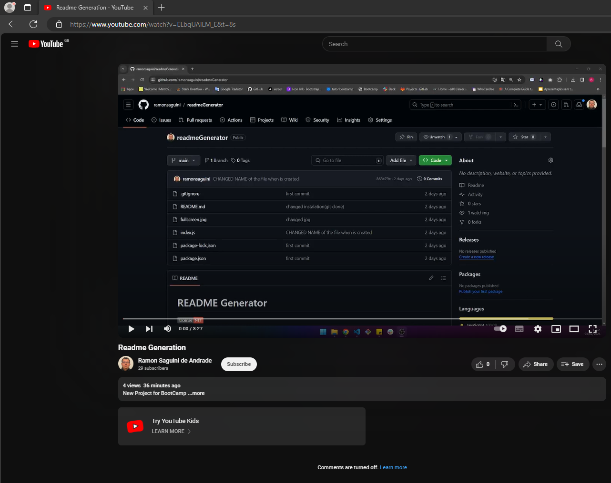

# README Generator

 

## Description

    The provided script is a Node.js application that generates a README.md file for a project based on user input.

## Table of Contents
- [Installation](#installation)
- [Usage](#usage)
- [Contribution](#contribution)
- [Tests](#tests)
- [License](#license)
- [Questions](#questions)

## Installation

    

    Click to Watch the video 
  

* To use this script, you'll first need to have Node.js installed on your computer. Then, follow these steps 

  * Copy and paste the script code into a file with a .js extension, for example, index.js

  or
  * clone the repo: git clone https://github.com/ramonsaguini/readmeGenerator.git
  
  * Open your terminal and navigate to the directory where you saved the file. >>  Run npm install inquirer in the terminal to install the necessary dependency for interactive prompts. 
  * After installing inquirer, you can run the script by typing node generateReadme.js in the terminal.
  * The script will start asking interactive questions related to your project. 
  * Answer each question as prompted. 

After answering all the questions, the script will automatically generate a README.md file based on your responses. You'll find the README.md file in the same directory where you're running the script. This README.md will contain all the sections filled in with the answers you provided during the script execution.

## Usage

This script utilizes the inquirer package to prompt the user with a series of questions about their project, such as the project title, description, installation instructions, usage information, contribution guidelines, testing, instructions, chosen license, GitHub username, and email address. 

Once the user answers all the questions, the script dynamically generates a README.md file with the provided information structured in markdown format. The generated README includes sections for the project title, project image (if provided), description, table of contents, installation instructions, usage information, contribution guidelines, testing instructions, chosen license, and contact information. 

This project simplifies the process of creating a README.md file for a project by automating the formatting and content generation based on user input, ensuring consistency and completeness across projects.

## Contribution

Ramon Andrade

## Tests

When prompted by the script, provide the testing instructions in the specific question. 

Ensure to provide clear and concise instructions on how to test your project. This may include: 
* Any dependencies required for testing. 
* Specific commands to be executed to initiate the tests.
* Description of test cases and their expectations. 
* Any other relevant information for testers to understand and successfully execute the tests. 
* After inputting the testing instructions, continue answering the remaining questions as prompted by the script.  

Once you have answered all the questions, the script will automatically generate the README.md file with your testing instructions and other provided information. 

To ensure your testing instructions are understandable and comprehensive, you can review the generated README.md file to verify that all information has been included correctly. 

If necessary, you can manually edit the generated README.md file to adjust or add more details to the testing instructions.
After reviewing and confirming that the README.md is as desired, you can include this file in your project as part of the documentation so that users can easily understand and test your project. 

Following these steps will help ensure that your project's testing instructions are effectively communicated to users, aiding in the testing process and overall project usability.

## License
This project is licensed under the MIT License.

## Questions
For questions about this project, please reach out to [@ramonsaguini](https://github.com/ramonsaguini) or contact ramon_saguini1@hotmail.com.
